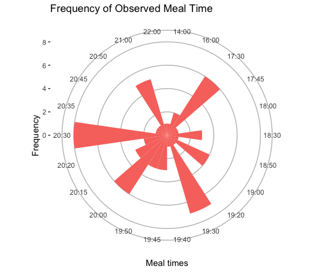

## DAT-203: Data Visualization and Business Intelligence 

### Vidualize Yourself - Final Project

### Abstract

There is broad concesus among doctors and scientists regarding the effect of blue light emitting from electronic devices having a negative impact on sleep quality. The Sleep Foundation conducted a [poll in 2011](https://www.sleepfoundation.org/wp-content/uploads/2018/10/SIAP_2011_Summary_of_Findings.pdf?x95607&x14342) which found that a significant proportion of adults used electronic devices before going to bed. Poor sleep quality has a demonstrably negative effect on overall health and, as noted by the UK's National Health Service, can lead to [obesity, cardio-vascular disease, diabetes, and even lower life expectancy.](https://www.nhs.uk/live-well/sleep-and-tiredness/why-lack-of-sleep-is-bad-for-your-health/)

The purpose of this project is to take a snapshot of my own sleep quality and identify whether or not screen time is affecting the quality of sleep I experience. I'm hoping that the results of this data collection and the subsequent analysis will be able to dictact any behavior changes in my life. Additionally, one of the goals I'm hoping to achieve is designing, analyzing, and executing a time study of my own. This would be a valuable experience and a different experience for me, as I've mostly stuck to analyzing existing data sets.

### Goals

My goals for this project are:

* Design a data collection schema and define a data dictionary
* Produce compelling graphics to visualize the data collected
* Combine the graphics with analysis of data set
* Use the visualizations and analysis to make a data backed claim

### Method

In order to aggregate observations for this project I designed a spreadsheet to log the data. I set the spreadsheet up in a way that mimicked a time series with all values indexed by a particular date. In order to best use statistical tools and R, I designed that values in a given time series to be integers, referring either to time in minutes, hourly time, scale values, or a binary. I felt that this design would lend itself to better processing. The scales are defined in the [data dictionary.](https://github.com/zachary-trozenski/dat203_ccac/blob/master/visualize_yourself/factor_tracker/data_dictionary.md)

### Data Collection

Data collection was done daily, once for the current day and then to also log the values for the previous evening. The method I used was likely the best I could could have hoped for since it was easy to use and the csv format allowed for flexibility in the coding languages I used. Once the data collection was completed I used R to read and manipulate the dataframe. It was then with R in which I produced my visualizations.

### Analysis

First in order to get a sense for sleep quality over time, and to glean whether or not there were any patterns, I plotted the observed quality over time.


```
# Descriptive statistics for sleep quality of the full data set
#  Min. 1st Qu.  Median   Mean   3rd Qu.   Max. 
  1.000   2.000   2.000   2.242   3.000   4.000 

# Standard deviation:
0.7171319
```

The line graph shows that the majority of the observed night's sleep quality was within the 1 - 4 range. The median value was `2` while the mean value of `2.42`. The standard deviation was calculated to be `0.717` indicating that the range of the data was not very large, mostly concentrated around the median. The median value of `2` seems to be in line with my expectations. Raising an infant and getting used to being a parent means thay my sleep quality will take a hit by waking up more frequently at night to tend to their needs. However I think that conclusion doesn't take other factors into context.

To answer the crux of the data collection I ran descriptive statistics on the totals of all print and screen times in order to understand my habits better statistically.

##### Screen time descriptive statistics
```
#   Min. 1st Qu.  Median  Mean    3rd Qu.  Max. 
    0.0    60.0   115.0   109.8   143.8   270.0 

# Standard deviation: 
58.34063
```

##### Print time descriptive statistics
```
#  Min.   1st Qu.  Median  Mean   3rd Qu.  Max. 
   0.00    0.00    0.00   18.71   38.75  120.00 

# Standard deviation: 
26.5693
```

The conclusions that I'm drawing here is I spent significantly fewer minutes reading print materials than I did using a screen. Anecdotally, I know that I've spent a lot of time playing video games or on my phone, which is a hard habit to break. Between school and work there isn't a lot of time for all forms of entertainment. But as it stands the contrast in pre-bed activities are stark. 

Knowing the statistics for total time observed however does not paint a full picture. How would I rate my sleep compared to each category of pre-bed activity? I've plotted the quality scale value by the number of minutes spent either reading or with screened device.


The graphs are by no means conclusive but they do shed so light on how sleep was rated given the previous evening's activities. True to the descriptive statistics, print time before sleep has few data points, but the majority of the observations do appear to have the `3` rating. What's interesting here is that a median of about 25 minutes seems to correlate to having 3 quality sleep which is above average for my in the observed period. If we extrapolate a hypothesis from this, it seems that the more time spent reading print before bed results in higher sleep quality. Does the inverse hold true for screen time? As it so happens, at least by analyzing the trend of the median we see negative correlation between the amount of time spent on a screened device and sleep quality. It didn't seem obvious on the outset but the data does indicate correlation. I calculated the correlation coefficient to have concrete data to back this up.

#### Correlation coefficients
```
# Correlation coefficient for sleep quality scale and screen time: 
-0.263

# Correlation coefficient for sleep quality scale and print time: 
0.180
```

While we can't say definitively the correlation is there based on the weak correlation coefficients our eye tests are validated as we see positive and negative coefficients for print time and screen time, respectively.

Pivoting over to some variables, I'd like to take a look at diet affects sleep quality. First, I'd like to get a sense for when during the observed period I ate dinner most frequently.



Judging by the graph the most frequent times are 20:30, 19:30, 20:00, and 17:30. There's a strong mix here and I think it's heavily influenced by having 3 night classes a week. However I'd like to zoom in on the sleep quality on evenings when I had a later dinner. So I sliced my dataframe by choosing all observations where the mealtime was greater than 19:30. Then I ran descriptive statistics on the subset's sleep quality scale values. I chose to do this over visualizing sleep quality and meal times in the same visualization as any data transformation would have muddled the data.

```
#  Min.  1st Qu.  Median  Mean    3rd Qu.  Max. 
  1.000   2.000   2.000   2.171   2.500   4.000 

# Standard deviation:
0.6635
```

Compared to the descriptive statistics of the full data, sleep quality with later meal times has a similar median (which is should since it contains all the data within the subset too). Interesting to see is the change in mean and standard deviation, as it looks like the data is concentrated more on the mean, which is itself lower. I didn't think meal times plays a significant factor into the quality of sleep, but we can see there is some jitter in the sleep quality of later meal times as compared to the full dataset.

### Conclusion


### Reflection

Looking back I think there are some other variables I would have tried to log. Though it may be inaccurate logging the time I fell asleep would have also been a valuable data point. Accounting for my infant son would also also be a necessary contextual point since I normally don't wake up during the night at all. I had also tried to log personal responsibilities but while that was ambitious it was impossible to truly quantify. 

While this project was a good exercise in essentially running a time study and analyzing the results, I think the data wasn't that interesting. I think I would have preferred a little more structure or something more specific to analyze. I think I would have also appreciated a little more class time dedicated to setting up a time study and discussing the output/results thereof. A little more time on business intelligence may have also helped identify what was important. Either way I do feel the graphics I was able to produce are concise and highly descriptive.

### Links and Resources

* [Data dictionary](https://github.com/zachary-trozenski/dat203_ccac/blob/master/visualize_yourself/factor_tracker/data_dictionary.md)
* [Data set](https://github.com/zachary-trozenski/dat203_ccac/blob/master/visualize_yourself/factor_tracker/factor_tracker_v3.csv)
* [Visualizations](https://github.com/zachary-trozenski/dat203_ccac/tree/master/visualize_yourself/visualizations)